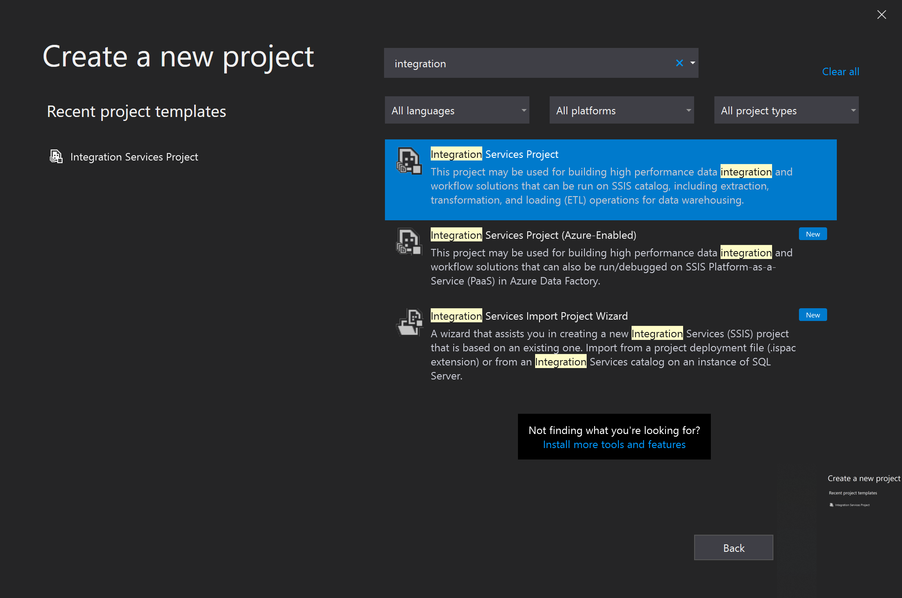
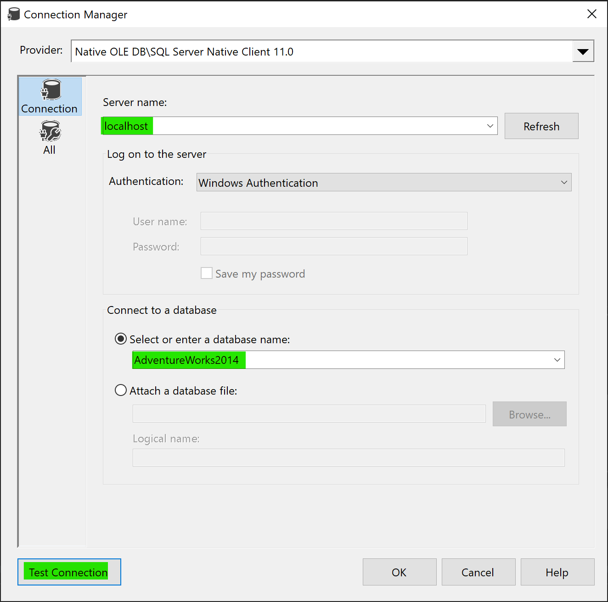
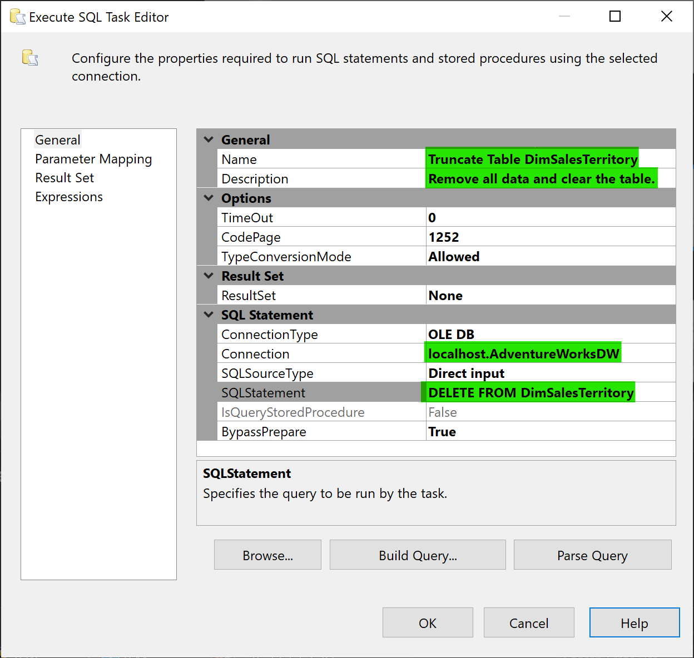

# Workshop - Data Warehousing
In this workshop you'll learn how to design, extract, transform and load a datawarehouse using SQL Server Data Tools(SSDT) and SQL Server Integration Services(SSIS). At the end of this workshop you'll be able to schedule certain background jobs to update the datawarehouse based on a schedule.

## Prerequisites
- SQL Server 2017+ Installed;
- **S**QL **S**erver **M**anagement **S**tudio Installed;
- **S**QL **S**erver **D**ata **T**ools Installed;
- **S**QL **S**erver **I**ntegration **T**services Installed;
- A running copy of the database **AdventureWorks2014**.
- If you've followed the [installation guide](/docs/installation.md) everything should be ready to go.

## Getting started
1. Create a new database called `AdventureWorksDW`;
2. Create the following tables using the scripts below
    - DimSalesTerritory
    - DimDate
    ```sql
    CREATE TABLE [DimSalesTerritory]
    (
        [SalesTerritoryKey] INT NOT NULL,
        [SalesTerritoryRegion] NVARCHAR(50) NOT NULL,
        [SalesTerritoryCountry] NVARCHAR(50) NOT NULL,
        [SalesTerritoryGroup] [nvarchar](50) NOT NULL,
        CONSTRAINT PK_DimSalesTerritory PRIMARY KEY([SalesTerritoryKey])
    )
    ```
    ```sql
    CREATE TABLE [DimDate] 
    (
        [DateKey] INT NOT NULL,
        [FullDateAlternateKey] DATE NOT NULL,
        [EnglishDayNameOfWeek] VARCHAR(50) NOT NULL,
        [DutchDayNameOfWeek] VARCHAR(50) NOT NULL,
        [MonthNumber] TINYINT NOT NULL,
        [EnglishMonthName] VARCHAR(50) NOT NULL,
        [DutchMonthName] VARCHAR(50) NOT NULL,
        [CalendarQuarter] TINYINT NOT NULL,
        [CalendarYear] SMALLINT NOT NULL
        CONSTRAINT PK_DimDate PRIMARY KEY(DateKey)
    )
    ```
3. Prepare the extraction of the data by creating 2 VIEWs in the `AdventureWorks2014` database, we'll be using these views later on so it's good practise to get to know the inner workings.
    ```sql
    CREATE VIEW VwSalesTerritory AS
    SELECT
    SalesTerritory.TerritoryID AS SalesTerritoryKey
    ,SalesTerritory.[Name]		AS SalesTerritoryRegion
    ,CountryRegion.[Name]		AS SalesTerritoryCountry
    ,SalesTerritory.[Group]		AS SalesTerritoryGroup
    FROM Sales.SalesTerritory SalesTerritory 
        JOIN Person.CountryRegion CountryRegion on SalesTerritory.CountryRegionCode = CountryRegion.CountryRegionCode;
    ```
    ```sql
    CREATE VIEW VwDimDate AS
    SELECT DISTINCT
    CAST(FORMAT(OrderDate,'yyyyMMdd') AS INT) AS DateKey
    ,OrderDate AS FullDateAlternateKey
    ,FORMAT(OrderDate,'dddd','en-UK') AS EnglishDayNameOfWeek
    ,FORMAT(OrderDate,'dddd','nl-NL') AS DutchDayNameOfWeek
    ,MONTH(OrderDate) AS MonthNumber
    ,FORMAT(OrderDate,'MMMM','en-UK') AS EnglishMonthName
    ,FORMAT(OrderDate,'MMMM','nl-NL') AS DutchMonthName
    ,DATEPART(q,OrderDate) AS CalenderQuarter
    ,DATEPART(YYYY,OrderDate) CalenderYear
    FROM Sales.SalesOrderHeader
    WHERE OnlineOrderFlag = 1
    ```
4. Create a new `Integration Services Project` using Visual Studio 2017+ called `AdventureWorks`.
    
    > If you do not get the project option, make sure to revisit the steps in the [installation guide](/docs/installation.md).
5. Right click on `package.dtsx` in the solution explorer to rename it to `FillDW.dtsx`
    > Deep Dive : The `.dtsx` extension is a shorthand for `Data Transformation Service`, the former name of SSIS. The Data Transformation Services Package XML (DTSX) file format is an XML-based file format that stores the instructions for the processing of a data flow, including transformations and optional processing steps, from its points of origin to its points of destination, [learn more](https://docs.microsoft.com/en-us/openspecs/sql_data_portability/ms-dtsx/806ed920-d25a-4a0e-b54d-628c689e4c2b).
    
## Setting up the Connections Managers 
Configure two `Connection Managers` one which connects to the newly created `AdventureWorksDW` and one which connects to the OLTP `AdventureWorks2014`. This will allow us to re-use connections in multiple packages and steps. Take the following actions:
1. In the solution explorer, right click on `Connection Managers`, select `New Connection Manager`.
2. Select the `OLEDB` option and click `add`.
3. Click `New...` 
4. In the Server Name field, type `localhost` and select the `AdventureWorks2014` database.
5. Test the connection by clicking the `Test Connection` button and make sure you're able to connect to the database.

6. Repeat step 3-5 for the `AdventureWorksDW` database.

6. By now your solution should look similar to the following screenshot:


## Extract data
We want to extract data from the OLTP database `AdventureWorks2014` and load it into the data warehouse `AdventureWorksDW`, automagically based on certain criteria.

### Clearing the dimensions
Before we start filling the dimension tables of the data warehouse, we want to delete all records from the table `DimSalesTerritory` before each transfer. Therefore we need a `Execute SQL Task`. 
1. Drag the `Execute SQL Task` from the toolbox onto the `Control Flow` tab.
2. Double click the `Execute SQL Task` in the `Control Flow` and edit the fields according to the screenshot below.
.

### Filling the dimensions
Once we know the table is empty by truncating the DimSalesTerritory table, we can start stuffing it with data coming from the OLTP database `AdventureWorks2014`.
1. Drag the `Data Flow Task` from the toolbox onto the `Control Flow` tab, rename the task to `Fill Table DimSalesTerritory`.
2. Connect the preceding task, so that after a successful `Truncate` statement the `Data Flow Task` is started. You can add as many follow-ups on a failiure or successful execution. 
.
3. Double click the "Fill Table DimSalesTerritory" task, the `Data Flow` tab is now active and selected, notice how the SSIS toolbar changed based on the selected tab `Control Flow` vs. `Data Flow`.  
4. Add and connect two data flow tasks a `Source Assistant` and a `Destination Assistant`. In the source assistant make a connection to `AdventureWorks2014` and in the destination assistant to `AdventureWorksDW`. Select the view `VwSalesTerritory` in the **source** and the table `DimSalesTerritory` in the **destination**. Click and check “Mappings” in the destination. 


